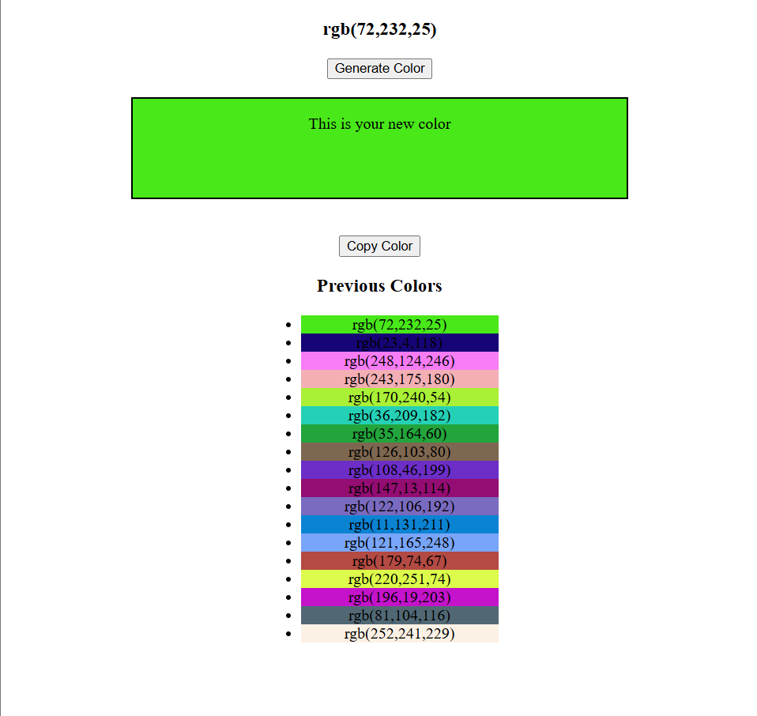

# Random-color-generator
A simple and interactive Random RGB Color Generator built using HTML, CSS, and JavaScript.
This project generates a random RGB color every time the button is clicked, displays its RGB value, allows users to copy the color code, and keeps a history of previously generated colors.

## Features

- 🎲 Generate random RGB colors
- 📋 Copy RGB code to clipboard
- 🖌️ Live background color preview
- 📝 Previous colors history
- ⚡ Fast and lightweight

## Screenshot

